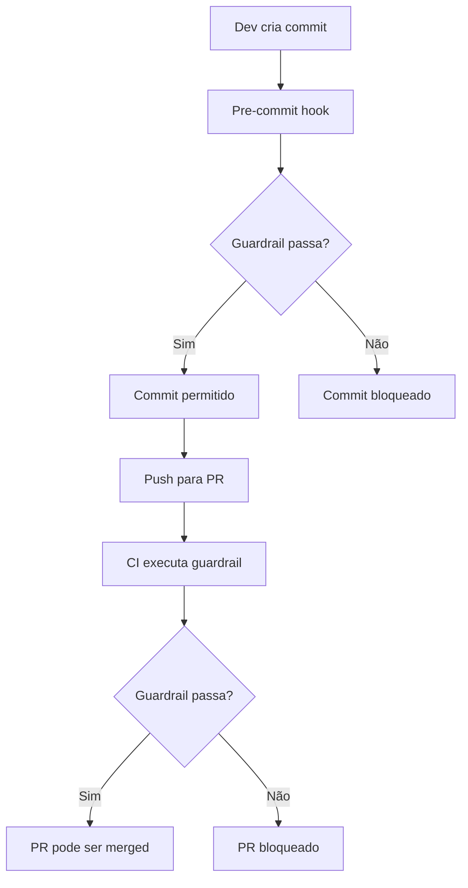

# Guardrails de Segregação Executor/GEMINI

## Propósito

Garantir que o protocolo de segregação entre Executor (Copilot/VS Code) e GEMINI (externo) seja respeitado, impedindo simulações locais de auditorias.

## Regra Fundamental

**Arquivos `*-ack*.json` e `*-result*.json` apenas podem existir se tiverem prova de origem externa.**

## Como Funciona

### 1. Guardrail Anti-Simulação

**Script**: `deny-local-audit-results.js` (Node.js) ou `deny-local-audit-results.ps1` (PowerShell)

**Verifica**:

- Todos os arquivos em `ai-tasks/events/**/*-ack*.json`
- Todos os arquivos em `ai-tasks/events/**/*-result*.json`

**Para cada arquivo suspeito, exige**:

- Arquivo `proof-of-origin.txt` no mesmo diretório
- Conteúdo obrigatório em `proof-of-origin.txt`:
  - Data/hora da coleta
  - Link do chat externo (e.g., https://chat.openai.com/share/...)
  - Hash SHA256 do JSON (para integridade)

**Se violação detectada**:

- Exit code 1 (falha)
- Bloqueia commit (pre-commit hook)
- Bloqueia merge de PR (CI workflow)

### 2. Estrutura de Prova de Origem

**Exemplo de `proof-of-origin.txt` válido**:

```
Data: 2025-12-13 10:45:30
Link: https://chat.openai.com/share/abc123def456
Hash: a1b2c3d4e5f6789012345678901234567890abcdef1234567890abcdef123456
Autor: João Silva
Nota: Auditoria de hardening final executada pelo GEMINI 2.0 Flash
```

**Como gerar hash**:

```powershell
# PowerShell
Get-FileHash -Path product-audit-result.json -Algorithm SHA256

# Node.js
node -e "console.log(require('crypto').createHash('sha256').update(require('fs').readFileSync('product-audit-result.json')).digest('hex'))"
```

### 3. Uso

**Validação manual**:

```bash
# Node.js
node scripts/guardrails/deny-local-audit-results.js

# PowerShell
pwsh scripts/guardrails/deny-local-audit-results.ps1
```

**Pre-commit hook** (automático via Husky):

```bash
npm install
# Hook roda automaticamente em git commit
```

**CI workflow** (automático em PRs):

- GitHub Actions executa guardrail
- PR bloqueado se falhar

## Exemplos

### ✅ Cenário Válido

```
ai-tasks/events/
  product-audit-result.json       # Arquivo RESULT do GEMINI
  proof-of-origin.txt             # Prova com data + link + hash
```

**Resultado**: ✅ Guardrail passa

### ❌ Cenário Inválido 1: RESULT sem prova

```
ai-tasks/events/
  product-audit-result.json       # Sem proof-of-origin.txt
```

**Resultado**: ❌ Guardrail falha - "proof-of-origin.txt não existe"

### ❌ Cenário Inválido 2: Prova incompleta

```
ai-tasks/events/
  product-audit-result.json
  proof-of-origin.txt             # Só tem data, falta link e hash
```

**Resultado**: ❌ Guardrail falha - "falta link do chat externo"

### ❌ Cenário Inválido 3: Hash não corresponde

```
ai-tasks/events/
  product-audit-result.json       # Conteúdo: {...}
  proof-of-origin.txt             # Hash: abc123 (errado)
```

**Resultado**: ❌ Guardrail falha - "hash SHA256 não corresponde"

## Integração com Workflow



## Arquivos

- `deny-local-audit-results.js` - Guardrail Node.js (uso em CI)
- `deny-local-audit-results.ps1` - Guardrail PowerShell (uso local Windows)
- `README.md` - Esta documentação

## Filosofia

> **Quem executa não audita. Quem audita não escreve código. Quem decide não controla o canal.**

Este guardrail implementa segregação de funções, eliminando possibilidade de autoavaliação (executor simulando auditor).
